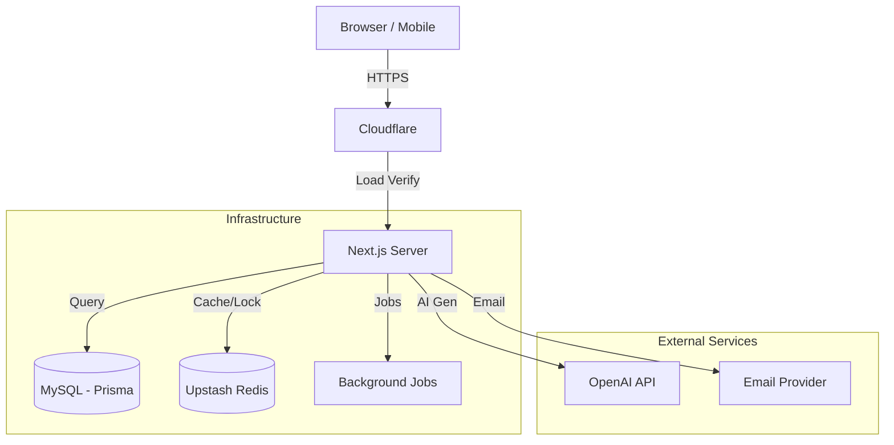

# System Architecture

## 1. High-Level Overview

ProSektorWeb is a **B2B SaaS Monolith** built on Next.js 15 (App Router), focusing on server-side rendering and stateless scaling.

## 2. Key Architectural Decisions

| Decision | Context | Trade-off |
| :--- | :--- | :--- |
| **Server Components First** | Use React Server Components for data fetching. | **Pro:** No client waterfall, SEO friendly. **Con:** Learning curve, strictly serialized props. |
| **Cache-Aside Pattern** | Explicit `getOrSet` wrapper vs implicit cache. | **Pro:** Full control over invalidation keys (`dashboard:stats`). **Con:** Requires manual key management. |
| **Prisma ORM** | Type-safe database access. | **Pro:** Productivity & Safety. **Con:** Cold start latency in serverless (mitigated by long-running container). |
| **Pino Logging** | Structured JSON logging in prod. | **Pro:** Machine-readable, queryable. **Con:** Harder to read manually without tools (jq). |
| **Upstash Redis** | HTTP-based Redis connection. | **Pro:** Works in serverless/edge without connection pool issues. **Con:** Slightly higher latency than TCP connection. |

## 3. Performance & Caching Strategy

We use a **Multi-Layer Caching** strategy:
1.  **L1 Memory:** Short-lived (seconds) process-local cache for extremely hot paths.
2.  **L2 Redis:** Distributed cache (minutes/hours) for expensive aggregations.
3.  **HTTP Cache:** `Cache-Control` headers for public static content (Blog/Categories).

**Stampede Protection:**
All expensive queries are wrapped in `getOrSet`, which implements **Singleflight** (deduplication) to ensure only one database query runs per key per instance, even under load.

## 4. Observability

-   **Logs:** All output is JSON structured. Contains `level`, `time`, `service`, `requestId`.
-   **Correlation:** `requestId` is propagated through the stack.
-   **Redaction:** PII (Email, Password, Token) is strictly redacted at the logger level.
-   **Metrics:** We track specific events via `logger.info` (e.g., `invoice_created`, `cache_miss`).

## 5. Security

-   **Authentication:** NextAuth.js (Session based).
-   **Authorization:** RBAC via Middleware + `tenant-guard` (Company Isolation).
-   **Rate Limiting:** Sliding Window (Redis) implemented in `src/lib/rate-limit.ts`.
-   **Input Validation:** Strict Zod schemas for all Server Actions.

## 6. Data Integrity & Data Types Policy

We enforce strict rules to prevent overflow and future-compatibility issues.

### 6.1 Counters & Numbers
-   **Monotonic Counters:** MUST use `BigInt` (SQL: `BIGINT`). **Never `Int` (32-bit).**
    -   *Why:* 2 Billion limit is easily reached by logs/views over years. "Int(11)" is a display myth; capacity is determined by type.
-   **Increments:** MUST be atomic via database updates (`UPDATE table SET count = count + 1`).
    -   *Never:* Read -> Application Increment -> Write (Race Condition Risk).
-   **Negative Guards:** Counters MUST have database-level checks (`CHECK (count >= 0)`) or application-level clamping.

### 6.2 Timestamps
-   **Type:** MUST be `DateTime` (SQL: `TIMESTAMP(3)` or `TIMESTAMPTZ`).
-   **Epochs:** NEVER store timestamps as `Int32` (Unix Epoch). This crashes in 2038.
-   **Timezone:** ALWAYS store as UTC. Conversion happens at the UI layer.

### 6.3 Keys & Identifiers
-   **Primary Keys:** Prefer `UUID` (String) or `BigInt` with Auto-Increment.
    -   *Why:* Int32 keys run out. UUIDs allow easy merging/sharding later.
-   **References:** Foreign keys must match the type of the referenced column exactly.

