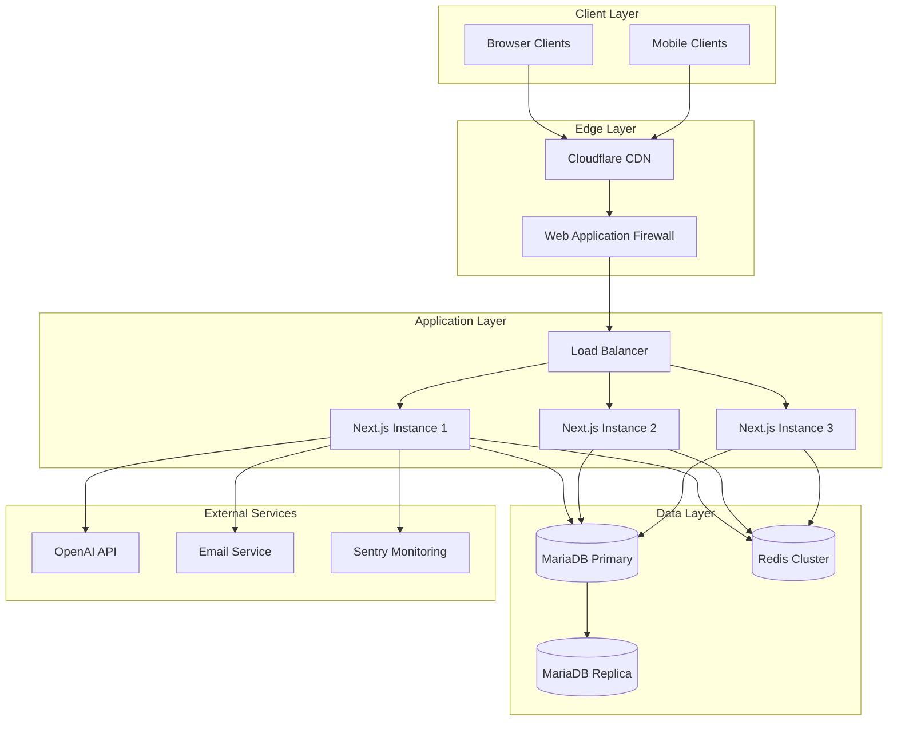
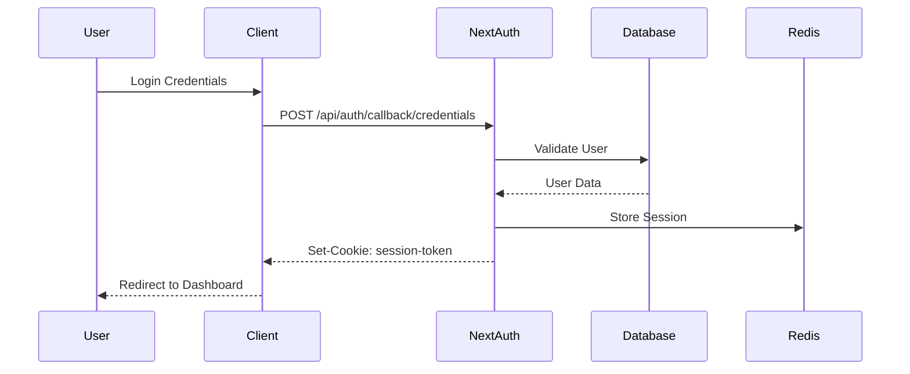
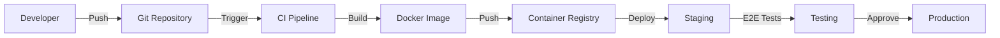

# ProSektorWeb - Production Architecture

> **Version:** 1.0.0  
> **Last Updated:** 2026-01-28  
> **Status:** Production Ready

## Executive Summary

ProSektorWeb is a comprehensive B2B SaaS platform for OSGB (Occupational Health and Safety) companies in Turkey. This document outlines the production-ready architecture, deployment strategies, and operational guidelines.

---

## 1. System Overview

### 1.1 Architecture Pattern
- **Pattern:** Modular Monolith with Feature-Based Organization
- **Framework:** Next.js 16 (App Router)
- **Runtime:** Node.js 20+
- **Deployment:** Containerized with Docker

### 1.2 High-Level Architecture



---

## 2. Technology Stack

### 2.1 Core Technologies

| Layer | Technology | Version | Purpose |
|-------|------------|---------|---------|
| **Framework** | Next.js | 16.1.2 | Full-stack React framework |
| **Language** | TypeScript | 5.x | Type-safe development |
| **Runtime** | Node.js | 20+ | Server runtime |
| **Database** | MariaDB | 10.11 | Primary data store |
| **ORM** | Prisma | 7.2.0 | Database access |
| **Cache** | Redis | 7.x | Caching & sessions |
| **Auth** | NextAuth.js | 5.0.0-beta | Authentication |
| **Styling** | Tailwind CSS | 4.x | UI styling |
| **UI Components** | Radix UI | Latest | Accessible components |

### 2.2 Infrastructure Technologies

| Component | Technology | Purpose |
|-----------|------------|---------|
| **Containerization** | Docker | Application packaging |
| **Orchestration** | Docker Compose | Local development |
| **Reverse Proxy** | Traefik | Load balancing, SSL |
| **Monitoring** | Prometheus + Grafana | Metrics & dashboards |
| **Logging** | Loki + Grafana | Log aggregation |
| **Error Tracking** | Sentry | Error monitoring |

---

## 3. Project Structure

```
prosektorweb/
├── src/
│   ├── app/                    # Next.js App Router
│   │   ├── (auth)/            # Auth route group
│   │   ├── (dashboard)/       # Dashboard route group
│   │   ├── api/               # API routes
│   │   ├── admin/             # Admin panel
│   │   ├── portal/            # Client portal
│   │   └── ...
│   ├── components/            # Shared UI components
│   │   ├── ui/               # Base UI components
│   │   ├── layout/           # Layout components
│   │   └── ...
│   ├── features/             # Feature-based modules
│   │   ├── auth/            # Authentication
│   │   ├── crm/             # CRM functionality
│   │   ├── finance/         # Invoices & payments
│   │   ├── projects/        # Project management
│   │   ├── support/         # Tickets & contact
│   │   └── system/          # Admin & analytics
│   ├── lib/                 # Shared utilities
│   │   ├── ai/             # AI integrations
│   │   ├── auth/           # Auth utilities
│   │   ├── pipeline/       # Content pipeline
│   │   └── ...
│   ├── hooks/               # Custom React hooks
│   ├── types/               # TypeScript types
│   └── styles/              # Global styles
├── prisma/
│   ├── schema.prisma         # Database schema
│   └── migrations/           # Database migrations
├── public/                   # Static assets
├── e2e/                      # Playwright tests
├── docker/                   # Docker configurations
├── scripts/                  # Utility scripts
└── docs/                     # Documentation
```

---

## 4. Database Architecture

### 4.1 Schema Overview

The database is organized into logical domains:

1. **Core OSGB System** - Companies, workplaces, employees
2. **CRM System** - Contacts, activities, notes
3. **Finance System** - Invoices, payments, services
4. **Project System** - Web projects, domains, deployments
5. **Content System** - Blog, generated content
6. **Support System** - Tickets, messages
7. **Analytics System** - Site analytics, lead captures
8. **Security System** - Users, audit logs, sessions

### 4.2 Key Design Decisions

| Decision | Rationale |
|----------|-----------|
| **UUID Primary Keys** | Prevents enumeration, enables sharding |
| **Soft Deletes** | Data recovery, audit trail |
| **Optimistic Locking** | Version fields for concurrent updates |
| **Idempotency Keys** | Duplicate request prevention |
| **JSON Columns** | Flexible metadata storage |
| **Proper Indexing** | Query performance optimization |

### 4.3 Replication Strategy

- **Primary:** Write operations
- **Replica:** Read operations, reporting
- **Backup:** Daily automated backups

---

## 5. API Architecture

### 5.1 API Design Principles

- **RESTful** design with consistent patterns
- **Versioned** endpoints (`/api/v1/...`)
- **Standardized** response format
- **Rate limited** per endpoint
- **Authenticated** via JWT sessions
- **Idempotent** for state-changing operations

### 5.2 Response Format

```typescript
interface ApiResponse<T> {
  success: boolean;
  data?: T;
  error?: string;
  code?: string;
  details?: any;
  pagination?: {
    page: number;
    limit: number;
    total: number;
    totalPages: number;
  };
  meta: {
    requestId: string;
  };
}
```

### 5.3 Security Headers

All API responses include security headers:
- `X-Request-Id` - Request correlation
- `X-RateLimit-Limit` - Rate limit info
- `X-RateLimit-Remaining` - Remaining requests
- `X-RateLimit-Reset` - Reset timestamp

---

## 6. Security Architecture

### 6.1 Authentication Flow



### 6.2 Authorization Model

**Role-Based Access Control (RBAC):**
- `ADMIN` - Full system access
- `DOCTOR` - Medical staff access
- `EXPERT` - Safety expert access
- `OFFICE` - Office staff access
- `CLIENT` - Customer portal access

**Tenant Isolation:**
- Company-based data isolation
- Row-level security in database
- Middleware-level access control

### 6.3 Security Measures

| Layer | Measure | Implementation |
|-------|---------|----------------|
| **Transport** | TLS 1.3 | Cloudflare/Traefik |
| **Headers** | Security headers | next.config.ts |
| **CSRF** | Origin validation | middleware.ts |
| **Rate Limit** | Sliding window | Redis-based |
| **Input** | Zod validation | All endpoints |
| **Output** | DOMPurify | XSS prevention |
| **Secrets** | Encryption at rest | AES-256 |

---

## 7. Caching Strategy

### 7.1 Multi-Layer Caching

```
┌─────────────────────────────────────────┐
│           L1: Memory Cache              │
│     (Process-local, seconds TTL)        │
├─────────────────────────────────────────┤
│           L2: Redis Cache               │
│     (Distributed, minutes/hours TTL)    │
├─────────────────────────────────────────┤
│           L3: HTTP Cache                │
│     (CDN/Browser, configurable TTL)     │
└─────────────────────────────────────────┘
```

### 7.2 Cache Invalidation

- **Tag-based:** Invalidate by entity tags
- **Time-based:** TTL expiration
- **Event-based:** Cache on data changes
- **Manual:** Admin-triggered purge

### 7.3 Key Patterns

```
user:{id}              # User sessions
company:{id}           # Company data
dashboard:stats        # Dashboard statistics
blog:posts:list        # Blog post lists
api:{endpoint}:{hash}  # API response cache
```

---

## 8. Observability

### 8.1 Logging

**Structured JSON logging** with Pino:
- Request correlation via `requestId`
- Automatic PII redaction
- Log levels: debug, info, warn, error
- Contextual metadata

**Log Categories:**
- Application logs
- Access logs
- Audit logs (compliance)
- Error logs

### 8.2 Metrics

**Application Metrics:**
- Request duration
- Error rates
- Cache hit/miss ratios
- Database query performance

**Business Metrics:**
- Active users
- Revenue
- Conversion rates
- Pipeline success rates

### 8.3 Tracing

- Distributed tracing with OpenTelemetry
- Request flow visualization
- Performance bottleneck identification
- Dependency mapping

---

## 9. Deployment Architecture

### 9.1 Environment Strategy

| Environment | Purpose | Data |
|-------------|---------|------|
| **Development** | Local development | Synthetic |
| **Staging** | Pre-production testing | Anonymized production |
| **Production** | Live system | Real data |

### 9.2 Deployment Pipeline



### 9.3 Rollback Strategy

- **Blue-Green Deployment:** Zero-downtime updates
- **Database Migrations:** Backward-compatible changes
- **Feature Flags:** Gradual rollout
- **Automated Rollback:** Health check failures

---

## 10. Scalability

### 10.1 Horizontal Scaling

- **Stateless application servers**
- **Session storage in Redis**
- **Database read replicas**
- **CDN for static assets**

### 10.2 Vertical Scaling

- **Database connection pooling**
- **Application memory optimization**
- **CPU-intensive task offloading**

### 10.3 Auto-Scaling Triggers

| Metric | Threshold | Action |
|--------|-----------|--------|
| CPU | >70% for 5min | Scale up |
| Memory | >80% for 5min | Scale up |
| Response Time | >500ms p95 | Scale up |
| Error Rate | >1% | Alert + Investigate |

---

## 11. Disaster Recovery

### 11.1 Backup Strategy

| Data | Frequency | Retention |
|------|-----------|-----------|
| Database | Daily | 30 days |
| Database | Weekly | 12 weeks |
| Database | Monthly | 12 months |
| Files | Real-time | 30 days |

### 11.2 Recovery Objectives

- **RPO (Recovery Point Objective):** 1 hour
- **RTO (Recovery Time Objective):** 4 hours

### 11.3 Failover Procedures

1. Database replica promotion
2. DNS failover
3. Load balancer reconfiguration
4. Cache warming

---

## 12. Compliance & Security

### 12.1 Data Protection

- **KVKK Compliance:** Turkish data protection law
- **Encryption at Rest:** Database encryption
- **Encryption in Transit:** TLS 1.3
- **Data Retention:** Configurable policies

### 12.2 Audit Requirements

- **Audit Logs:** All data changes tracked
- **User Actions:** Login/logout, CRUD operations
- **System Events:** Configuration changes
- **Retention:** 7 years

---

## 13. Development Guidelines

### 13.1 Code Organization

- **Feature-based modules**
- **Shared utilities in lib/**
- **Component composition pattern**
- **Custom hooks for logic reuse**

### 13.2 Testing Strategy

| Type | Tool | Coverage |
|------|------|----------|
| Unit | Vitest | >80% |
| Integration | Vitest | Critical paths |
| E2E | Playwright | User flows |
| Accessibility | Axe | WCAG 2.1 AA |

### 13.3 Performance Budgets

| Metric | Target | Maximum |
|--------|--------|---------|
| First Contentful Paint | <1.5s | 2.5s |
| Largest Contentful Paint | <2.5s | 4s |
| Time to Interactive | <3.5s | 5s |
| Cumulative Layout Shift | <0.1 | 0.25 |

---

## 14. Operational Runbooks

### 14.1 Common Procedures

- **Database Migration:** `npx prisma migrate deploy`
- **Cache Flush:** Redis FLUSHDB
- **Log Rotation:** Automatic via Loki
- **Backup Verification:** Weekly restore tests

### 14.2 Alerting Rules

| Condition | Severity | Response |
|-----------|----------|----------|
| 5xx errors > 1% | Critical | Page on-call |
| Response time > 1s | Warning | Investigate |
| Disk usage > 85% | Warning | Clean up |
| Failed backups | Critical | Page on-call |

---

## 15. Future Roadmap

### 15.1 Short Term (3 months)

- [ ] GraphQL API layer
- [ ] Real-time notifications (WebSockets)
- [ ] Advanced analytics dashboard
- [ ] Mobile app (React Native)

### 15.2 Medium Term (6 months)

- [ ] Microservices extraction
- [ ] Kubernetes migration
- [ ] Multi-region deployment
- [ ] AI-powered insights

### 15.3 Long Term (12 months)

- [ ] Marketplace integration
- [ ] White-label solution
- [ ] International expansion
- [ ] Advanced automation

---

## Appendix

### A. Environment Variables

See `.env.example` for complete list.

### B. API Documentation

See `/docs/api` for OpenAPI specifications.

### C. Database Schema

See `prisma/schema.prisma` for complete schema.

### D. Changelog

See `CHANGELOG.md` for version history.

---

**Document Owner:** DevOps Team  
**Review Cycle:** Quarterly  
**Next Review:** 2026-04-28
