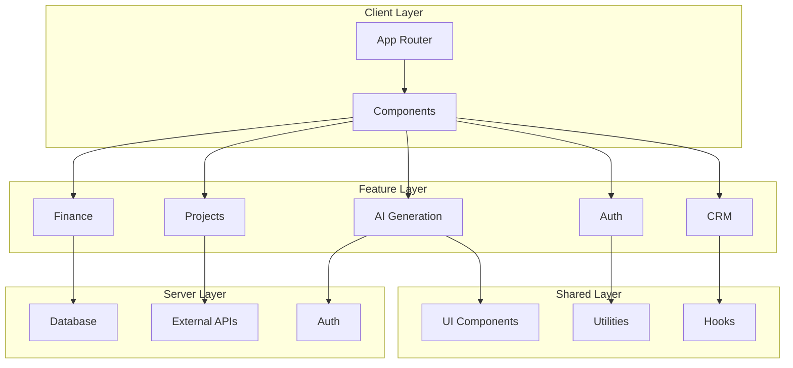

# ProsektorWeb

> Modern, ölçeklenebilir ve feature-based mimari ile geliştirilmiş Next.js fullstack uygulaması.

[](https://nextjs.org/)
[](https://react.dev/)
[](https://www.typescriptlang.org/)
[](https://www.prisma.io/)
[](https://mariadb.org/)

---

## 📋 İçindekiler

- [Özellikler](#-özellikler)
- [Mimari](#-mimari)
- [Kurulum](#-kurulum)
- [Geliştirme](#-geliştirme)
- [Proje Yapısı](#-proje-yapısı)
- [API Referansı](#-api-referansı)
- [Test](#-test)
- [Dağıtım](#-dağıtım)

---

## ✨ Özellikler

### 🏢 İş Yönetimi
- **Şirket Yönetimi**: Çoklu şirket desteği, detaylı şirket profilleri
- **Çalışan Yönetimi**: Personel kayıtları, yetkilendirme
- **İşyeri Yönetimi**: Lokasyon bazlı işyeri takibi

### 💰 Finans
- **Fatura Sistemi**: Otomatik fatura oluşturma ve PDF export
- **Ödeme Takibi**: Ödeme durumları ve geçmişi
- **Teklif Sistemi**: Dinamik teklif oluşturucu

### 🌐 Domain & Hosting
- **Domain Arama**: Cloudflare entegrasyonu ile domain sorgulama
- **DNS Yönetimi**: Otomatik DNS kaydı yönetimi
- **Domain Satın Alma**: Entegre domain kayıt süreci

### 🤖 AI Entegrasyonu
- **İçerik Üretimi**: AI destekli blog ve landing page içerikleri
- **SEO Optimizasyonu**: Otomatik meta tag ve içerik optimizasyonu
- **Pipeline Sistemi**: Çok aşamalı AI içerik pipeline'ı

### 👤 Müşteri Portalı
- **Müşteri Girişi**: Güvenli authentication
- **Proje Takibi**: Müşteri bazlı proje durumları
- **Doküman Erişimi**: Fatura ve teklif görüntüleme

---

## 🏗 Mimari

### Feature-Based Mimari

Proje, **Feature-Based Architecture** prensiplerine göre organize edilmiştir:

```
src/
├── app/              # Next.js App Router (routes, layouts)
├── features/         # Domain-specific feature modülleri
├── shared/           # Paylaşılan kaynaklar (UI Kit, utilities)
└── server/           # Server-only kodlar (DB, integrations)
```

### Katmanlı Yapı



### Önemli Mimari Kararlar

| Karar | Açıklama |
|-------|----------|
| **Feature-Based** | Her feature kendi actions, components, lib ve types'ını içerir |
| **Shared Module** | UI Kit ve ortak utilities merkezi bir yerde tutulur |
| **Server Module** | DB ve external integrations izole edilmiştir |
| **Soft Delete** | Prisma extension ile otomatik soft delete uygulanır |
| **Cache-Aside** | L1 Memory + L2 Redis ile çok katmanlı caching |

---

## 🚀 Kurulum

### Gereksinimler

- **Node.js**: >= 20.0.0
- **npm**: >= 10.0.0
- **Docker**: (opsiyonel, geliştirme ortamı için)

### Hızlı Başlangıç

```bash
# 1. Repoyu klonlayın
git clone <repo-url>
cd osgb/prosektorweb

# 2. Bağımlılıkları yükleyin
npm install

# 3. Ortam değişkenlerini yapılandırın
cp .env.example .env.local
# .env.local dosyasını düzenleyin

# 4. Veritabanını hazırlayın
npx prisma migrate dev
npx prisma generate

# 5. Geliştirme sunucusunu başlatın
npm run dev
```

### Docker ile Kurulum

```bash
# Geliştirme ortamı
docker-compose up -d

# Üretim ortamı
docker-compose -f docker-compose.prod.yml up -d
```

### Ortam Değişkenleri

| Değişken | Açıklama | Zorunlu |
|----------|----------|---------|
| `DATABASE_URL` | MariaDB bağlantı URL'i | ✅ |
| `REDIS_URL` | Redis bağlantı URL'i | ✅ |
| `NEXTAUTH_SECRET` | NextAuth.js secret key | ✅ |
| `NEXTAUTH_URL` | Uygulama URL'i | ✅ |
| `OPENAI_API_KEY` | OpenAI API anahtarı | ⚠️ (AI özellikleri için) |
| `CLOUDFLARE_API_TOKEN` | Cloudflare API token | ⚠️ (Domain özellikleri için) |
| `RESEND_API_KEY` | Resend email API anahtarı | ⚠️ (Email gönderimi için) |

---

## 💻 Geliştirme

### Kullanılabilir Script'ler

```bash
# Geliştirme sunucusu
npm run dev

# Production build
npm run build

# Linting
npm run lint

# Type checking
npm run typecheck

# Test
npm run test              # Tüm testleri çalıştır
npm run test:unit         # Unit testler
npm run test:e2e          # E2E testler
npm run test:coverage     # Coverage raporu

# Bağımlılık kontrolü
npm run deps:audit        # Güvenlik audit
npm run deps:check        # Kullanılmayan bağımlılıklar
```

### Import Path'leri

Proje, path alias'lar kullanır:

```typescript
// ✅ Doğru kullanım
import { Button } from '@/shared/components/ui';
import { logger } from '@/shared/lib';
import { prisma } from '@/server/db';
import { generateContent } from '@/features/ai-generation/lib/ai';

// ❌ Eski kullanım (deprecated)
import { Button } from '@/components/ui/Button';
import { logger } from '@/lib/logger';
```

---

## 📁 Proje Yapısı

```
prosektorweb/
├── src/
│   ├── app/                          # Next.js App Router
│   │   ├── (admin)/                  # Admin panel routes
│   │   ├── (landing)/                # Landing page routes
│   │   ├── (portal)/                 # Müşteri portal routes
│   │   ├── api/                      # API routes
│   │   └── layout.tsx                # Root layout
│   │
│   ├── features/                     # Feature modülleri
│   │   ├── ai-generation/            # AI içerik üretimi
│   │   │   ├── actions/              # Server actions
│   │   │   ├── components/           # Feature-specific components
│   │   │   ├── lib/                  # Business logic
│   │   │   │   ├── ai/               # AI connectors
│   │   │   │   ├── pipeline/         # Pipeline stages
│   │   │   │   └── deploy/           # Deployment logic
│   │   │   └── types/                # TypeScript types
│   │   │
│   │   ├── auth/                     # Authentication
│   │   ├── crm/                      # Customer Relationship
│   │   ├── finance/                  # Finans yönetimi
│   │   ├── projects/                 # Proje yönetimi
│   │   ├── support/                  # Destek sistemi
│   │   └── system/                   # Sistem utilities
│   │
│   ├── shared/                       # Paylaşılan kaynaklar
│   │   ├── components/
│   │   │   ├── ui/                   # UI Kit (Button, Input, etc.)
│   │   │   └── layout/               # Layout components
│   │   └── lib/                      # Utilities
│   │       ├── utils.ts              # Genel utilities
│   │       ├── logger.ts             # Pino logger
│   │       ├── cache.ts              # Caching layer
│   │       └── ...
│   │
│   ├── server/                       # Server-only kodlar
│   │   ├── db/                       # Prisma client
│   │   └── integrations/             # External API'ler
│   │
│   ├── components/                   # Legacy components (deprecated)
│   ├── lib/                          # Legacy lib (deprecated)
│   └── actions/                      # Legacy actions (deprecated)
│
├── prisma/                           # Prisma schema
├── public/                           # Static assets
├── e2e/                              # Playwright E2E tests
└── docs/                             # Ek dokümantasyon
```

---

## 📚 API Referansı

### Server Actions

#### AI Generation

```typescript
// İçerik üretimi
import { generateContent } from '@/features/ai-generation/actions/generation';

const result = await generateContent({
  prompt: "OSGB hizmetleri hakkında blog yazısı",
  type: "blog",
  options: {
    tone: "professional",
    length: "medium"
  }
});
```

#### Authentication

```typescript
// Giriş işlemi
import { login } from '@/features/auth/actions/auth-actions';

const result = await login({
  email: "user@example.com",
  password: "password123"
});
```

### API Routes

| Endpoint | Method | Açıklama |
|----------|--------|----------|
| `/api/auth/[...nextauth]` | ALL | NextAuth.js authentication |
| `/api/generate` | POST | AI içerik üretimi |
| `/api/cloudflare/domains` | GET | Domain sorgulama |
| `/api/invoices/[id]/pdf` | GET | Fatura PDF indirme |

---

## 🧪 Test

### Unit Test'ler

Vitest kullanılarak yazılmıştır:

```bash
# Tüm unit testleri çalıştır
npm run test:unit

# Watch mode
npm run test

# Coverage raporu
npm run test:coverage
```

### E2E Test'ler

Playwright kullanılarak yazılmıştır:

```bash
# E2E testleri çalıştır
npm run test:e2e

# UI modu
npx playwright test --ui
```

### Test Dosya Yapısı

```
src/
├── __tests__/                        # Test setup
├── lib/__tests__/                    # Lib unit testleri
├── actions/__tests__/                # Action testleri
└── features/
    └── [feature]/
        └── __tests__/                # Feature testleri
```

---

## 🚢 Dağıtım

### Docker Build

```bash
# Production image oluştur
docker build -t prosektorweb:latest .

# Container çalıştır
docker run -p 3000:3000 \
  --env-file .env.production \
  prosektorweb:latest
```

### Vercel

```bash
# Vercel CLI ile deploy
vercel --prod
```

### Manuel Deploy

```bash
# Build al
npm run build

# Start
npm start
```

---

## 📖 Ek Dokümantasyon

- [Refactor Durumu](./REFACTOR_STATUS.md) - Son refactor işlemleri
- [Lib Migration](./src/lib/README.md) - Eski lib'den yeni yapıya geçiş
- [Architecture Decision Records](./docs/adr/) - Mimari karar kayıtları

---

## 🤝 Katkıda Bulunma

1. Feature branch oluşturun: `git checkout -b feature/yeni-ozellik`
2. Değişikliklerinizi commit edin: `git commit -am 'Yeni özellik ekle'`
3. Branch'i push edin: `git push origin feature/yeni-ozellik`
4. Pull Request açın

---

## 📝 Lisans

Bu proje özel lisans altında lisanslanmıştır. Tüm hakları saklıdır.

---

## 🆘 Destek

Sorularınız veya sorunlarınız için:

- 📧 Email: destek@prosektor.com
- 🐛 Issues: GitHub Issues
- 📖 Docs: [Dokümantasyon](./docs/)
