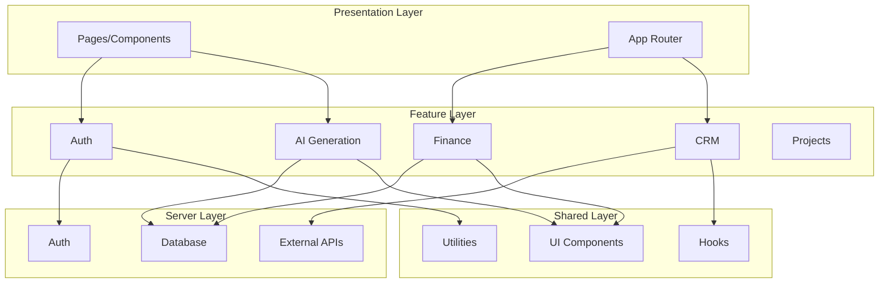
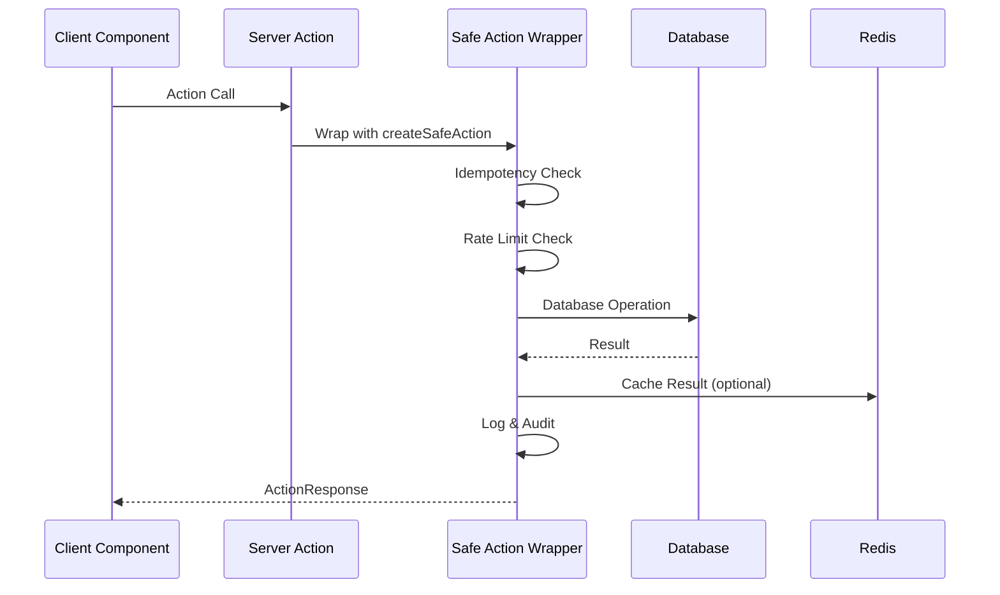
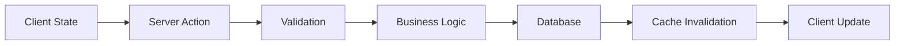
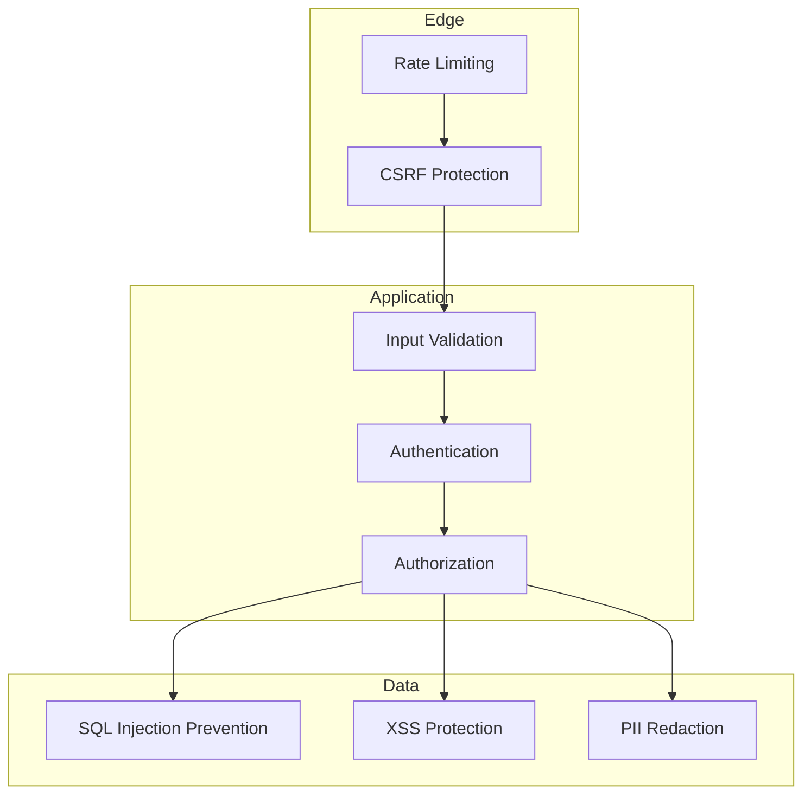
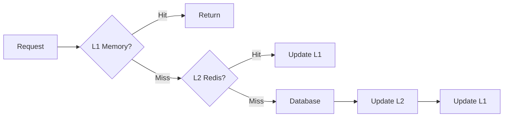
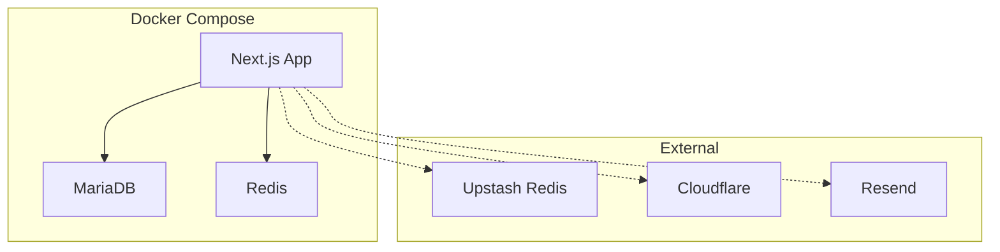

# ProsektorWeb Mimari Dokümantasyonu

> Feature-Based Architecture ile geliştirilmiş Next.js uygulaması mimarisi.

---

## 📋 İçindekiler

1. [Genel Bakış](#genel-bakış)
2. [Dizin Yapısı](#dizin-yapısı)
3. [Katmanlar](#katmanlar)
4. [Veri Akışı](#veri-akışı)
5. [State Yönetimi](#state-yönetimi)
6. [Güvenlik](#güvenlik)
7. [Performans](#performans)

---

## Genel Bakış

ProsektorWeb, modern web uygulamaları için en iyi pratikleri takip eden, ölçeklenebilir ve sürdürülebilir bir mimari üzerine kurulmuştur.

### Temel Prensipler

1. **Feature-Based Organization**: Kod, domain/feature bazında organize edilir
2. **Separation of Concerns**: Her katman belirli bir sorumluluğa sahiptir
3. **Dependency Rule**: İç katmanlar dış katmanlara bağımlı olamaz
4. **Explicit over Implicit**: Açık ve anlaşılır bağımlılıklar

---

## Dizin Yapısı

```
src/
├── app/                    # Next.js App Router
├── features/               # Domain-specific features
├── shared/                 # Paylaşılan kaynaklar
├── server/                 # Server-only kodlar
└── components/             # Legacy (deprecated)
```

### App Router (`app/`)

Next.js 13+ App Router yapısı. Sadece routing ve layout'ları içerir.

```
app/
├── (admin)/               # Admin panel route group
├── (landing)/             # Landing page route group
├── (portal)/              # Customer portal route group
├── api/                   # API routes
├── layout.tsx             # Root layout
└── globals.css            # Global styles
```

### Features (`features/`)

Her feature kendi içinde izole edilmiş yapıya sahiptir:

```
features/
├── ai-generation/
│   ├── actions/           # Server actions
│   ├── components/        # Feature-specific components
│   ├── lib/              # Business logic
│   ├── types/            # TypeScript types
│   └── hooks/            # Custom hooks
├── auth/
├── crm/
├── finance/
├── projects/
├── support/
└── system/
```

**Feature Yapısı:**

```typescript
// Her feature şu yapıyı takip eder:
feature-name/
├── actions/              # Server actions (Next.js)
│   └── [action].ts
├── components/           # React components
│   ├── [Component].tsx
│   └── index.ts
├── lib/                  # Business logic
│   ├── [module].ts
│   └── index.ts
├── types/                # TypeScript definitions
│   └── index.ts
└── hooks/                # Custom React hooks (opsiyonel)
    └── use[Hook].ts
```

### Shared (`shared/`)

Tüm feature'lar tarafından kullanılan ortak kaynaklar:

```
shared/
├── components/
│   ├── ui/               # UI Kit (Button, Input, etc.)
│   └── layout/           # Layout components
├── lib/                  # Utilities
│   ├── utils.ts
│   ├── logger.ts
│   ├── cache.ts
│   └── ...
└── hooks/                # Shared hooks (opsiyonel)
```

### Server (`server/`)

Server-only kodlar (client'ta asla çalıştırılmaz):

```
server/
├── db/                   # Database (Prisma)
│   ├── prisma.ts
│   └── schema/
├── integrations/         # External APIs
│   └── cloudflare.ts
└── index.ts             # Public API exports
```

---

## Katmanlar

### Katman Diyagramı



### Katman Kuralları

| Katman | İçeriği | Bağımlılıkları |
|--------|---------|----------------|
| **App** | Routes, Layouts | Features, Shared |
| **Features** | Actions, Components, Logic | Shared, Server |
| **Shared** | UI Kit, Utilities | None (pure) |
| **Server** | DB, Integrations | None (pure) |

---

## Veri Akışı

### Server Action Flow



### Data Fetching Patterns

#### 1. Server Component + Server Action

```typescript
// app/(admin)/dashboard/page.tsx
import { getStats } from '@/features/finance/actions/stats';

export default async function DashboardPage() {
    const stats = await getStats(); // Server Action
    return <Dashboard stats={stats} />;
}
```

#### 2. Client Component + useTransition

```typescript
'use client';

import { useTransition } from 'react';
import { createInvoice } from '@/features/finance/actions/invoices';

export function InvoiceForm() {
    const [isPending, startTransition] = useTransition();

    const handleSubmit = (data: FormData) => {
        startTransition(async () => {
            const result = await createInvoice(data);
            if (result.success) {
                // Handle success
            }
        });
    };

    return <form onSubmit={handleSubmit}>...</form>;
}
```

#### 3. Cache-Aside Pattern

```typescript
import { getOrSet } from '@/shared/lib/cache';

const data = await getOrSet(
    `user:${userId}`,
    () => db.user.findUnique({ where: { id: userId } }),
    { ttl: 300 }
);
```

---

## State Yönetimi

### Server State

- **Prisma**: Database state
- **Redis**: Cache & session state
- **NextAuth**: Authentication state

### Client State

- **React useState**: Local component state
- **React Context**: Feature-level state (opsiyonel)
- **URL State**: Navigation state (search params)

### State Flow



---

## Güvenlik

### Güvenlik Katmanları



### Güvenlik Özellikleri

| Özellik | Uygulama | Konum |
|---------|----------|-------|
| Rate Limiting | Sliding Window (Redis) | `shared/lib/rate-limit.ts` |
| CSRF | Origin check | `shared/lib/csrf.ts` |
| Input Validation | Zod schemas | Feature actions |
| Auth | NextAuth.js v5 | `features/auth/` |
| Authorization | RBAC + Tenant Guard | `shared/lib/auth-guard.ts` |
| SQL Injection | Prisma ORM | `server/db/` |
| XSS | DOMPurify | Input sanitization |
| PII Redaction | Pino redact paths | `shared/lib/logger.ts` |

---

## Performans

### Optimizasyon Stratejileri

#### 1. Caching



#### 2. Code Splitting

- **Route-based**: Next.js otomatik code splitting
- **Component-based**: Dynamic imports
- **Feature-based**: Feature modülleri lazy load edilebilir

#### 3. Database Optimizasyonu

- **Indexing**: Prisma schema'da tanımlı
- **Connection Pooling**: MariaDB connection pool
- **Query Optimization**: Prisma query logging

### Performans Metrikleri

| Metrik | Hedef | Mevcut |
|--------|-------|--------|
| First Contentful Paint | < 1.5s | - |
| Time to Interactive | < 3.5s | - |
| API Response Time (p95) | < 200ms | - |
| Database Query Time (p95) | < 50ms | - |

---

## Deployment

### Docker Architecture



### Environment Strategy

| Ortam | URL | Database | Redis |
|-------|-----|----------|-------|
| Development | localhost:3000 | Docker MariaDB | Docker Redis |
| Staging | staging.prosektor.com | Staging DB | Upstash |
| Production | prosektor.com | Production DB | Upstash |

---

## Geliştirme Rehberi

### Yeni Feature Ekleme

1. **Dizin oluştur:**
   ```bash
   mkdir -p src/features/new-feature/{actions,components,lib,types}
   ```

2. **Types tanımla:**
   ```typescript
   // src/features/new-feature/types/index.ts
   export interface NewFeatureConfig {
       // ...
   }
   ```

3. **Logic yaz:**
   ```typescript
   // src/features/new-feature/lib/logic.ts
   export function processData(data: Input): Output {
       // ...
   }
   ```

4. **Component oluştur:**
   ```typescript
   // src/features/new-feature/components/NewComponent.tsx
   'use client';
   export function NewComponent() {
       // ...
   }
   ```

5. **Action ekle:**
   ```typescript
   // src/features/new-feature/actions/actions.ts
   'use server';
   import { createSafeAction } from '@/shared/lib';

   export const performAction = createSafeAction(
       'newFeature:perform',
       async (data) => {
           // ...
       }
   );
   ```

6. **Export ekle:**
   ```typescript
   // src/features/new-feature/index.ts
   export * from './types';
   export * from './lib';
   export * from './actions';
   ```

### Import Kuralları

```typescript
// ✅ Doğru - Absolute imports
import { Button } from '@/shared/components/ui';
import { logger } from '@/shared/lib';
import { prisma } from '@/server/db';

// ✅ Doğru - Feature imports
import { generateContent } from '@/features/ai-generation/lib/ai';

// ✅ Doğru - Relative imports (aynı feature içinde)
import { helper } from '../lib/helper';

// ❌ Yanlış - Deep imports
import { Button } from '@/shared/components/ui/button/Button';

// ❌ Yanlış - Cross-feature imports
import { something } from '@/features/other-feature/lib/internal';
```

---

## Referanslar

- [Next.js Documentation](https://nextjs.org/docs)
- [Feature-Based Architecture](https://feature-sliced.design/)
- [Clean Architecture](https://blog.cleancoder.com/uncle-bob/2012/08/13/the-clean-architecture.html)
- [Prisma Best Practices](https://www.prisma.io/docs/guides/performance-and-optimization)
