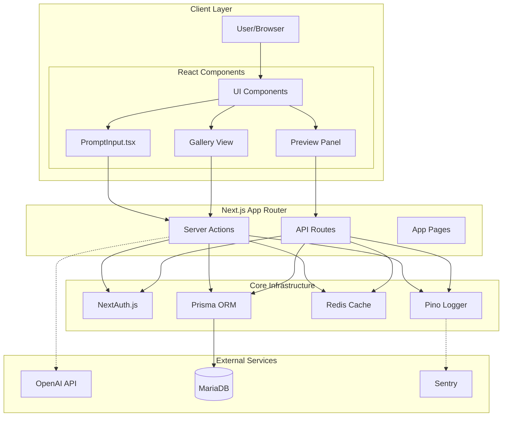
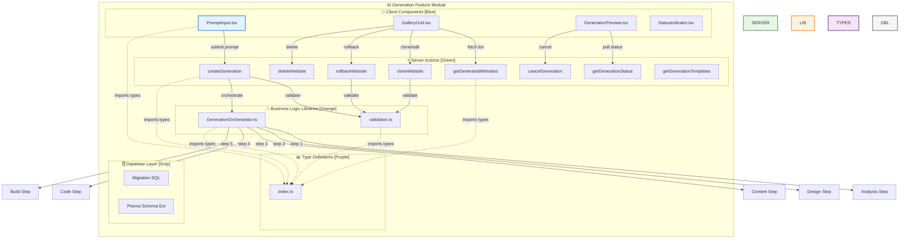
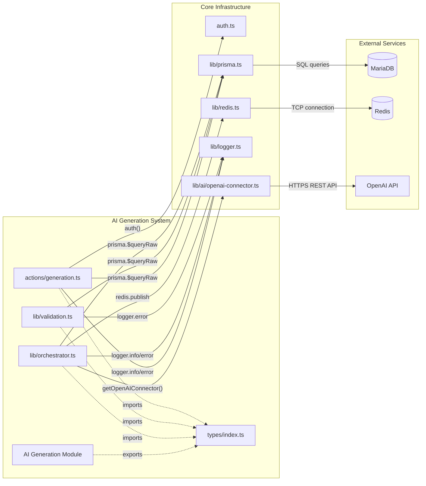
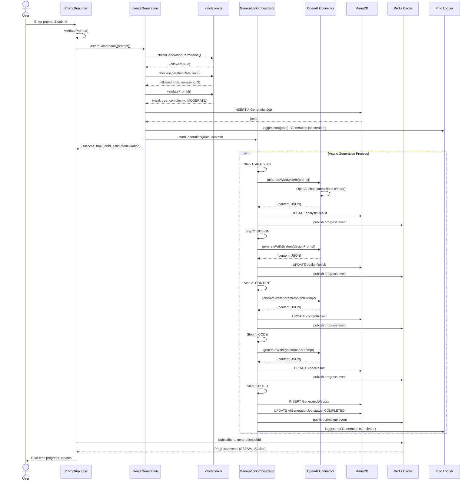
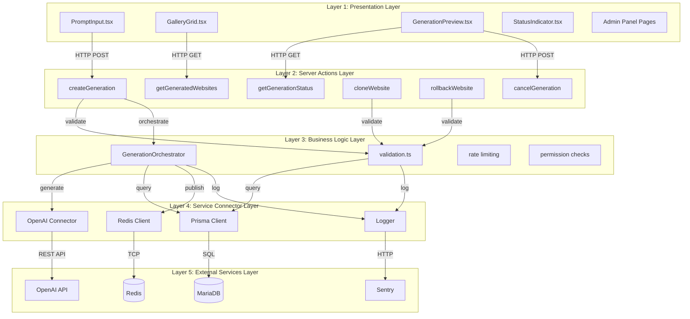
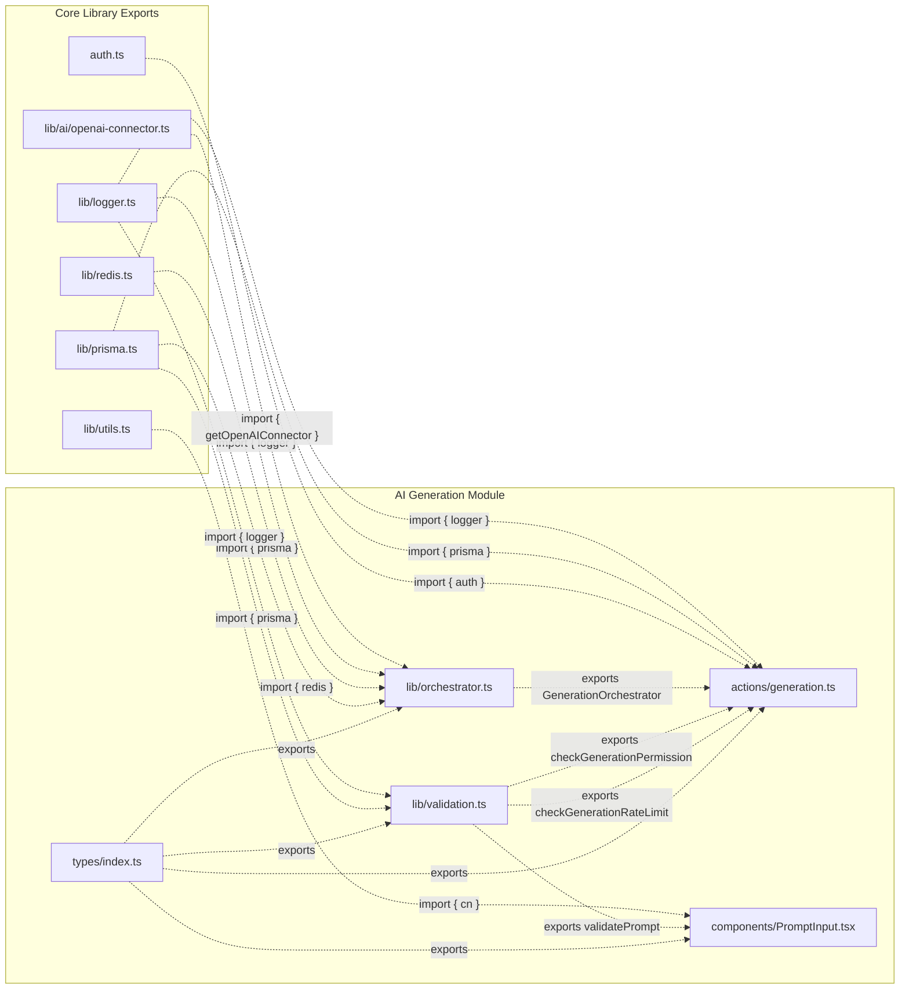
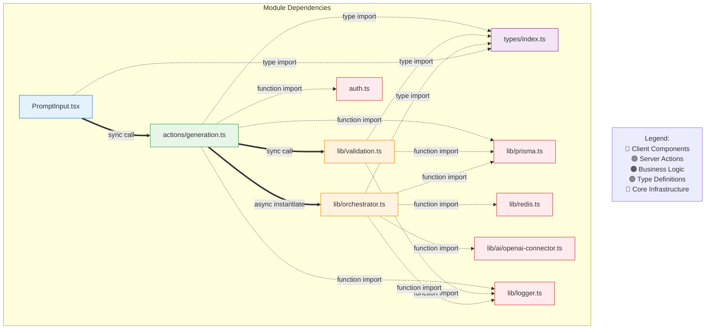
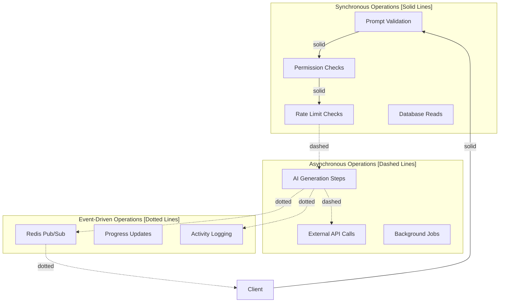
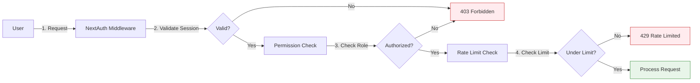

# ProSektorWeb - Visual Architecture Diagram

> **System Architecture & Module Dependency Map**
> **Last Updated:** 2026-01-28

---

## 🏗️ High-Level System Architecture



---

## 🤖 AI Generation Feature - Detailed Module Structure



---

## 🔗 Integration Points & Cross-Module Dependencies



---

## 📊 Data Flow - User Prompt to Persisted Website



---

## 🏛️ Layered Architecture



---

## 🔀 Import/Export Relationships



---

## 🎯 Dependency Graph with Relationship Types



---

## 📁 File Structure Map

```
prosektorweb/
├── src/
│   ├── features/
│   │   └── ai-generation/           # AI Generation Feature Module
│   │       ├── types/
│   │       │   └── index.ts         # Type definitions (exports all types)
│   │       ├── lib/
│   │       │   ├── validation.ts    # Validation & rate limiting
│   │       │   └── orchestrator.ts  # Generation workflow orchestrator
│   │       ├── actions/
│   │       │   └── generation.ts    # Server actions (8 actions)
│   │       └── components/
│   │           └── PromptInput.tsx  # Main input component
│   ├── lib/
│   │   ├── ai/
│   │   │   └── openai-connector.ts  # OpenAI integration
│   │   ├── prisma.ts                # Database client
│   │   ├── redis.ts                 # Cache client
│   │   ├── logger.ts                # Structured logging
│   │   └── utils.ts                 # Utility functions
│   ├── auth.ts                      # Authentication
│   └── app/
│       └── admin/
│           └── ai-generation/       # Admin panel pages
├── prisma/
│   └── migrations/
│       └── 20260128000000_add_ai_website_generation/
│           └── migration.sql        # Database schema
└── docs/
    └── ARCHITECTURE_DIAGRAM.md      # This file
```

---

## 🔄 Async Operation Patterns



---

## 📈 Data Flow Summary

| Stage | From | To | Operation Type | Data Format |
|-------|------|-----|----------------|-------------|
| 1. Input | User | PromptInput | User Action | String |
| 2. Validation | PromptInput | validation.ts | Sync Function | Object |
| 3. Submission | PromptInput | createGeneration | HTTP POST | JSON |
| 4. Permission | createGeneration | auth.ts | Function Call | Session |
| 5. Rate Check | createGeneration | validation.ts | DB Query | SQL |
| 6. Job Create | createGeneration | MariaDB | INSERT | SQL |
| 7. Orchestrate | createGeneration | orchestrator.ts | Async Init | Object |
| 8. AI Call | orchestrator.ts | OpenAI | HTTPS API | JSON |
| 9. Progress | orchestrator.ts | Redis | PUBLISH | Event |
| 10. Persist | orchestrator.ts | MariaDB | UPDATE | SQL |
| 11. Complete | orchestrator.ts | Redis | PUBLISH | Event |
| 12. Display | Redis | PromptInput | SUBSCRIBE | Event |

---

## 🎨 Color Coding Reference

| Color | Hex Code | Usage |
|-------|----------|-------|
| Blue | `#e3f2fd` / `#1976d2` | Client Components |
| Green | `#e8f5e9` / `#388e3c` | Server Actions |
| Orange | `#fff3e0` / `#f57c00` | Business Logic |
| Purple | `#f3e5f5` / `#7b1fa2` | Type Definitions |
| Red | `#ffebee` / `#c62828` | Core Infrastructure |
| Gray | `#f5f5f5` / `#616161` | Database Layer |

---

## 🔐 Security Flow



---

**Diagram Legend:**
- **Solid arrows (→)** = Synchronous function calls
- **Dashed arrows (-.->)** = Asynchronous operations / Imports
- **Thick arrows (==>)** = HTTP requests / Major data flow
- **Dotted arrows (...>)** = Event-driven communication
