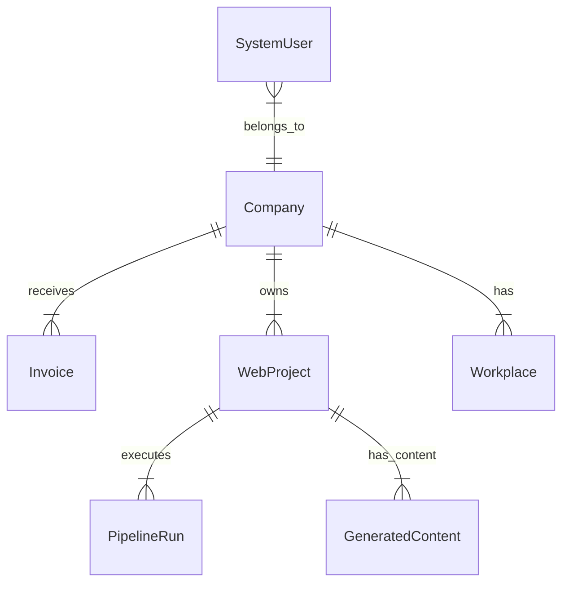

# Antigravity Database Design: ProSektorWeb

## 1. Assumptions & Domain
-   **Domain:** OSGB (Joint Health & Safety Unit) B2B SaaS.
-   **Tenancy:** `Company` is the Tenant. Users belong to a Company.
-   **Scale:** Low write volume (hundreds/day), High read volume (Dashboard analytics).
-   **Stack:** MariaDB (MySQL compatible), Prisma ORM.
-   **Key Entities:**
    -   **Company:** The customer entity (OSGB client).
    -   **WebProject:** A website being built/managed for a Company.
    -   **Invoice:** Financial record (High integrity required).
    -   **PipelineRun:** AI Generation workflow.

## 2. Top Access Patterns (Queries)
1.  **Dashboard Stats:** `SELECT sum(total) FROM Invoice WHERE companyId = ? AND status = 'PAID'`
2.  **Active Projects:** `SELECT * FROM WebProject WHERE companyId = ? AND status NOT IN ('DRAFT', 'CANCELLED')`
3.  **User Login:** `SELECT * FROM SystemUser WHERE email = ?` (Auth)
4.  **Global Search:** `SELECT * FROM Company WHERE name LIKE ? OR taxId LIKE ?`
5.  **Analytics:** `SELECT * FROM SiteAnalytics WHERE projectId = ? AND date BETWEEN ? AND ?`

## 3. ER Model (Normalized)



## 4. SQL DDL (MariaDB/MySQL Optimized)

### Identity & Profile

```sql
CREATE TABLE SystemUser (
    id CHAR(36) NOT NULL PRIMARY KEY, -- UUID
    email VARCHAR(191) NOT NULL UNIQUE,
    password VARCHAR(191) NOT NULL,
    role VARCHAR(50) DEFAULT 'OFFICE', -- ENUM handled by app
    name VARCHAR(191),
    isActive BOOLEAN DEFAULT TRUE,
    sessionVersion BIGINT DEFAULT 0,
    createdAt DATETIME(3) DEFAULT CURRENT_TIMESTAMP(3),
    updatedAt DATETIME(3)
);
```

### Company (Normalized)

```sql
CREATE TABLE Company (
    id CHAR(36) NOT NULL PRIMARY KEY, -- UUID
    name VARCHAR(191) NOT NULL,
    taxId VARCHAR(191),
    status VARCHAR(50) DEFAULT 'LEAD',
    INDEX idx_company_name (name)
);
```

### Invoicing (High Integrity)
Using `DECIMAL` for money is critical.

```sql
CREATE TABLE Invoice (
    id CHAR(36) NOT NULL PRIMARY KEY,
    companyId CHAR(36) NOT NULL,
    invoiceNo VARCHAR(191) NOT NULL UNIQUE,
    total DECIMAL(10, 2) NOT NULL,
    status VARCHAR(50) DEFAULT 'PENDING',
    createdAt DATETIME(3) DEFAULT CURRENT_TIMESTAMP(3),
    FOREIGN KEY (companyId) REFERENCES Company(id) ON DELETE CASCADE
);
```

## 5. Index Strategy

| Table | Columns | Type | Why? |
| :--- | :--- | :--- | :--- |
| `SystemUser` | `(email)` | UNIQUE | Login lookup (Point query) |
| `Invoice` | `(companyId, status)` | BTREE | "Unpaid invoices" dashboard widget |
| `Invoice` | `(issueDate DESC)` | BTREE | Recent activity feed |
| `Company` | `(name)` | BTREE | Autocomplete/Search |

## 6. Migration Plan (Evolution)

### Adding a Field
**Scenario:** Adding `middleName` to `SystemUser`.
1.  **Phase 1:** Add column `middleName VARCHAR(191) NULL`.
2.  **Phase 2:** Deploy code that reads/writes it.
3.  **Phase 3 (Optional):** Backfill default if needed.

