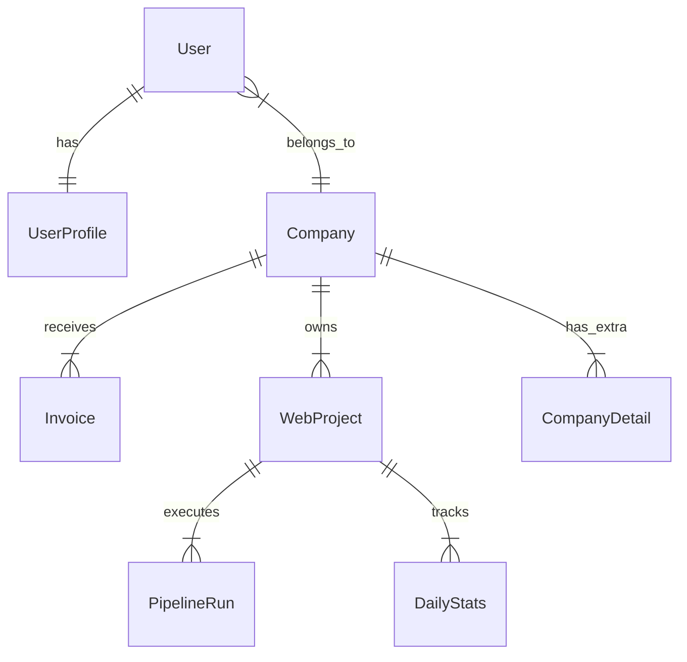

# Antigravity Database Design: ProSektorWeb

## 1. Assumptions & Domain
-   **Domain:** OSGB (Joint Health & Safety Unit) B2B SaaS.
-   **Tenancy:** `Company` is the Tenant. Users belong to a Company.
-   **Scale:** Low write volume (hundreds/day), High read volume (Dashboard analytics).
-   **Key Entities:**
    -   **Company:** The customer entity (OSGB client).
    -   **WebProject:** A website being built/managed for a Company.
    -   **Invoice:** Financial record (High integrity required).
    -   **PipelineRun:** AI Generation workflow (Transient, Logging heavy).

## 2. Top Access Patterns (Queries)
1.  **Dashboard Stats:** `SELECT sum(total) FROM invoices WHERE company_id = ? AND status = 'PAID'`
2.  **Active Projects:** `SELECT * FROM policies WHERE company_id = ? AND status NOT IN ('DRAFT', 'ARCHIVED')`
3.  **User Login:** `SELECT * FROM users WHERE email = ?` (Auth)
4.  **Global Search:** `SELECT * FROM companies WHERE name LIKE ? OR tax_id LIKE ?`
5.  **Analytics:** `SELECT * FROM daily_stats WHERE project_id = ? AND date BETWEEN ? AND ?`

## 3. ER Model (Normalized)



## 4. SQL DDL (PostgreSQL/Generic Optimized)

### Identity & Profile
Split auth credentials from profile data to keep the User table hot in cache.

```sql
CREATE TABLE users (
    id UUID PRIMARY KEY DEFAULT gen_random_uuid(),
    email VARCHAR(255) NOT NULL UNIQUE,
    password_hash VARCHAR(255) NOT NULL,
    role VARCHAR(50) DEFAULT 'CLIENT', -- ENUM
    company_id UUID REFERENCES companies(id),
    curr_session_version INT DEFAULT 1, -- Invalidate sessions
    created_at TIMESTAMP DEFAULT NOW(),
    deleted_at TIMESTAMP NULL -- Soft delete
);

CREATE TABLE user_profiles (
    user_id UUID PRIMARY KEY REFERENCES users(id),
    first_name VARCHAR(100),
    last_name VARCHAR(100),
    phone VARCHAR(20),
    avatar_url TEXT,
    preferences JSONB DEFAULT '{}' -- { theme: 'dark', notifs: true }
);
```

### Company (Normalized)
Core identity vs. details.

```sql
CREATE TABLE companies (
    id UUID PRIMARY KEY DEFAULT gen_random_uuid(),
    name VARCHAR(255) NOT NULL,
    tax_id VARCHAR(20) UNIQUE, -- VKN
    status VARCHAR(50) DEFAULT 'LEAD',
    created_at TIMESTAMP DEFAULT NOW()
);

CREATE TABLE company_details (
    company_id UUID PRIMARY KEY REFERENCES companies(id),
    address TEXT,
    city VARCHAR(100),
    danger_class VARCHAR(50), -- ENUM
    nace_code VARCHAR(10),
    contact_email VARCHAR(255),
    contact_phone VARCHAR(20)
);
```

### Invoicing (High Integrity)
No JSON for money. Strict decimals.

```sql
CREATE TABLE invoices (
    id UUID PRIMARY KEY,
    company_id UUID NOT NULL REFERENCES companies(id),
    invoice_no VARCHAR(50) NOT NULL UNIQUE, -- 2024-001
    amount_subtotal DECIMAL(12,2) NOT NULL,
    amount_tax DECIMAL(12,2) NOT NULL,
    amount_total DECIMAL(12,2) NOT NULL,
    status VARCHAR(20) DEFAULT 'DRAFT', -- DRAFT, SENT, PAID, VOID
    due_date DATE,
    created_at TIMESTAMP DEFAULT NOW()
);

-- Index for Dashboard Sums
CREATE INDEX idx_invoices_dashboard ON invoices(company_id, status, due_date);
```

### Analytics (Time-Series)
Optimized for range queries.

```sql
CREATE TABLE daily_stats (
    id UUID PRIMARY KEY,
    project_id UUID NOT NULL,
    date DATE NOT NULL,
    visitors INT DEFAULT 0,
    page_views INT DEFAULT 0,
    -- JSON ok here for dynamic breakdowns that change structure often
    meta_breakdown JSONB, -- { source: {google: 10, direct: 5} }
    UNIQUE(project_id, date)
);
```

## 5. Index Strategy

| Table | Columns | Type | Why? |
| :--- | :--- | :--- | :--- |
| `users` | `(email)` | UNIQUE | Login lookup (Point query) |
| `invoices` | `(company_id, status)` | B-TREE | "Unpaid invoices" dashboard widget |
| `invoices` | `(issue_date DESC)` | B-TREE | Recent activity feed |
| `daily_stats` | `(project_id, date DESC)` | B-TREE | "Last 30 days" chart query |
| `companies` | `(name varchar_pattern_ops)` | B-TREE | Autocomplete/Search (Postgres specific) |

## 6. Migration Plan (Evolution)

### Adding a Field
**Scenario:** Adding `middle_name` to `user_profiles`.
1.  **Phase 1:** Add column `middle_name VARCHAR NULL`.
2.  **Phase 2:** Deploy code that reads/writes it.
3.  **Phase 3 (Optional):** Backfill default if needed.
4.  **Phase 4:** Add `NOT NULL` constraint if strictness required.

### Splitting a Table (Refactoring `Company`)
**Scenario:** Moving address fields to `company_details`.
1.  **Create** `company_details` table.
2.  **Dual Write:** Application writes to BOTH `companies.address` and `company_details.address`.
3.  **Backfill:** Script copies old data to new table.
4.  **Switch Read:** App reads from `company_details`.
5.  **Stop Write:** App stops writing to `companies.address`.
6.  **Drop:** Drop column `companies.address`.
